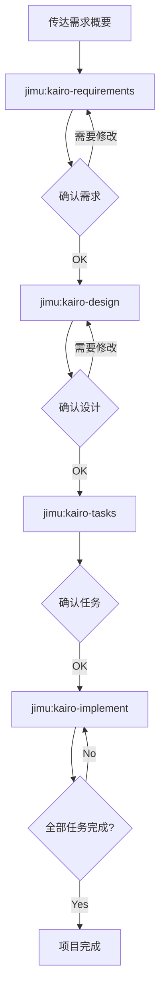

# Jimu 手册

## 使用方法

### 设置

使用 Claude Code Plugin 安装 Jimu:

```bash
/plugin marketplace add https://github.com/tetrisKun/jimu.git
/plugin install jimu@jimu
```

**注意**: 命令使用 `/jimu:` 前缀执行(例: `/jimu:kairo-requirements`)。

#### 项目特定规则设置

设置后,可以添加项目特定的规则和配置。
如果在 `docs/rule/{类型1}/{类型2}` 目录结构中放置文件,会在执行对应命令时自动加载。

**加载的目录层次**:
- `docs/rule/` (公共规则)
- `docs/rule/{类型1}/` (类型级别规则)
- `docs/rule/{类型1}/{类型2}/` (详细级别规则)

**例**: 执行 `kairo-requirements` 时
```
docs/rule/                    # 所有命令公共规则
docs/rule/kairo/              # kairo 命令公共规则
docs/rule/kairo/requirements/ # kairo-requirements 专用规则
```

这些目录内的 `.md` 文件会在命令执行时作为上下文自动加载。

### TDD 命令

如果在创建 TASK 时判定为 `TDD`,想单独执行 TDD 流程时,可以依次执行以下命令:

```
# TDD 需求定义
/jimu:tdd-requirements 任务文件名　TASK编号

# 创建测试用例
/jimu:tdd-testcases 任务文件名　TASK编号

# 测试实现(Red)
/jimu:tdd-red 任务文件名　TASK编号

# 最小实现(Green)
/jimu:tdd-green 任务文件名　TASK编号

# 重构
/jimu:tdd-refactor 任务文件名　TASK编号

# TDD 完成确认
/jimu:tdd-verify-complete 任务文件名　TASK编号
```

### DIRECT 命令

如果在创建 TASK 时判定为 `DIRECT`,可以依次执行以下命令:

```
# DIRECT 准备
/jimu:direct-setup 任务文件名　TASK编号

# DIRECT 验证
/jimu:direct-verify 任务文件名　TASK编号
```

### Kairo 命令(综合流程)

#### 1. 技术栈初始化

初始化项目的技术栈(框架、库):

```
/jimu:init-tech-stack
```

init-tech-stack 生成以下内容:

生成的文件: `/docs/tech-stack.md` 下

#### 2. 需求定义

首先,向 Kairo 传达项目的需求概要:

```
/jimu:kairo-requirements 需求概要

# 提示示例:
# "想实现电商网站的商品评价功能。
#  用户可以对商品进行5星评分和评论,
#  可以查看其他用户的评价。"
```

Kairo 生成以下内容:
- 用户故事
- 使用 EARS 记法的详细需求定义
- 边缘案例考虑
- 验收标准

生成的文件: `/docs/spec/{需求名}-requirements.md`

#### 3. 设计

确认·修改需求后,请求设计:

```
/jimu:kairo-design(或可省略)

# 请告知已批准需求
```

Kairo 生成以下内容:
- 架构设计文档
- 数据流图(Mermaid)
- TypeScript 接口定义
- 数据库模式
- API 端点规范

生成的文件: `/docs/design/{需求名}/` 下

#### 4. 任务分割

确认设计后(可省略批准),执行任务分割:

```
/jimu:kairo-tasks

# 请告知已批准设计(或可省略)
```

建议执行 `/jimu:kairo-task-verify` 来确认任务内容。

Kairo 生成以下内容:
- 考虑依赖关系的任务列表
- 各任务的详细信息(包括测试需求、UI/UX需求)
- 执行顺序和进度安排

生成的文件: `/docs/tasks/{需求名}-tasks.md`

#### 5. 实现

确认任务后,开始实现:
(建议手动执行 TDD 循环或 DIRECT)

```
# 按顺序实现所有任务
/jimu:kairo-implement

# 只实现特定任务
/jimu:kairo-implement  任务文件名　TASK编号
# "请实现TASK-101"
```

Kairo 对每个任务内部使用 TDD 命令执行以下流程:
1. TDD 需求定义(tdd-requirements)
2. 创建测试用例(tdd-testcases)
3. 测试实现(tdd-red)
4. 最小实现(tdd-green)
5. 重构(tdd-refactor)
6. TDD 完成确认(tdd-verify-complete)

### 逆向工程命令

如果要从现有代码库逆向生成各种文档,可以依次执行以下命令:

```
# 从现有代码分析任务结构
/jimu:rev-tasks

# 逆向生成设计文档(建议在任务分析后执行)
/jimu:rev-design

# 逆向生成测试规范(建议在设计文档后执行)
/jimu:rev-specs

# 逆向生成需求定义书(建议在完成所有分析后执行)
/jimu:rev-requirements
```

#### 逆向工程详情

##### 概述

逆向工程命令分析现有代码库,从实现逆向推导生成各种文档。

##### 推荐执行顺序

1. **rev-tasks** - 分析整个代码库掌握任务结构
2. **rev-design** - 生成架构和设计文档
3. **rev-specs** - 生成测试规范和测试用例
4. **rev-requirements** - 最后生成需求定义书

##### 各命令详情

###### rev-tasks(任务结构分析)

**目的**: 从现有代码提取·整理已实现的功能作为任务

**生成的文件**:
- `docs/reverse/{项目名}-discovered-tasks.md`

**分析内容**:
- 掌握代码库结构
- 识别已实现功能
- 提取 API 端点
- 分析数据库结构
- 推测任务依赖关系

###### rev-design(逆向生成设计文档)

**目的**: 从已实现的架构生成技术设计文档

**生成的文件**:
- `docs/reverse/{项目名}-architecture.md`
- `docs/reverse/{项目名}-dataflow.md`
- `docs/reverse/{项目名}-api-specs.md`
- `docs/reverse/{项目名}-database.md`
- `docs/reverse/{项目名}-interfaces.ts`

**分析内容**:
- 识别架构模式
- 提取数据流
- 提取 API 规范
- 逆向生成数据库模式
- 整理 TypeScript 类型定义

###### rev-specs(逆向生成测试规范)

**目的**: 从实现代码逆向生成测试用例和规范

**生成的文件**:
- `docs/reverse/{项目名}-test-specs.md`
- `docs/reverse/{项目名}-test-cases.md`
- `docs/reverse/tests/` - 生成的测试代码

**分析内容**:
- 分析现有测试
- 识别不足的测试用例
- 生成 API 测试用例
- 生成 UI 组件测试
- 建议性能·安全测试

###### rev-requirements(逆向生成需求定义书)

**目的**: 使用 EARS 记法从实现功能逆向生成需求定义书

**生成的文件**:
- `docs/reverse/{项目名}-requirements.md`

**分析内容**:
- 逆推用户故事
- 使用 EARS 记法分类需求
- 推测非功能需求
- 识别边缘案例
- 生成验收标准

##### 使用示例

```bash
# 逆向分析整个项目
/jimu:rev-tasks
# → 掌握任务结构

/jimu:rev-design
# → 文档化架构和设计

/jimu:rev-specs
# → 分析测试状况识别不足的测试

/jimu:rev-requirements
# → 最后生成需求定义书
```

##### 注意事项

- 请务必审查每个步骤生成的内容
- 推测的需求可能与实际业务需求不同
- 测试用例是从实现状况推测的,可能不完整

## 目录结构

```
./
├── .claude/
│   └── commands/           # Kairo 命令
├── docs/
│   ├── implements/        # 实现代码
│   │   └── {任务ID}/
│   ├── spec/              # 需求定义书
│   ├── design/            # 设计文档
│   ├── tasks/             # 任务列表
│   └── reverse/           # 逆向文档
├── backend/              # 后端代码
├── frontend/             # 前端代码
└── database/             # 数据库相关
```

## 工作流示例



## 优势

1. **一致的开发流程**
   - 从需求到实现的统一流程
   - 使用 EARS 记法明确定义需求

2. **保证质量**
   - 通过 TDD 命令实现稳健的实现
   - 全面的测试覆盖率

3. **高效开发**
   - 自动的任务分割和优先级排序
   - 可视化依赖关系

4. **全面的文档**
   - 需求、设计、实现全部文档化
   - 便于后期参考

## 注意事项

- 每个步骤都会请求用户确认
- 请务必审查生成的内容
- 可能需要根据项目特性进行调整

## 故障排除

### Q: 需求太复杂怎么办?
A: 请将需求分割为多个小功能,对每个功能执行 Kairo。

### Q: 可以应用于现有代码库吗?
A: 可以。在分析现有代码的基础上,可用于添加新功能或修改。

### Q: 可以自定义吗?
A: 可以。通过编辑各命令文件,可以进行适合项目的自定义。

## 支持

如有问题或疑问,请在项目的 Issue 追踪器中报告。