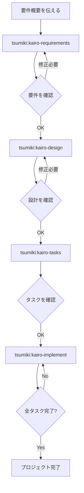

# Tsumiki マニュアル

## 使用方法

### セットアップ

Claude Code Pluginを使用してTsumikiをインストールします：

```bash
/plugin marketplace add https://github.com/classmethod/tsumiki.git
/plugin install tsumiki@tsumiki 
```

**注意**: コマンドは `/tsumiki:` プレフィックス付きで実行します（例：`/tsumiki:kairo-requirements`）。

#### プロジェクト固有のルール設定

セットアップ後、プロジェクト固有のルールや設定を追加できます。
`docs/rule/{種類1}/{種類2}` ディレクトリ構造でファイルを配置すると、対応するコマンド実行時に自動で読み込まれます。

**読み込まれるディレクトリ階層**:
- `docs/rule/` （共通ルール）
- `docs/rule/{種類1}/` （種類レベルのルール）
- `docs/rule/{種類1}/{種類2}/` （詳細レベルのルール）

**例**: `kairo-requirements` 実行時
```
docs/rule/                    # 全コマンド共通ルール
docs/rule/kairo/              # kairoコマンド共通ルール  
docs/rule/kairo/requirements/ # kairo-requirements専用ルール
```

これらのディレクトリ内の `.md` ファイルは、コマンド実行時にコンテキストとして自動読み込みされます。

### TDDコマンド

TASK作成時に `TDD` と判定している場合で個別にTDDプロセスを実行したい場合は、以下のコマンドを順次実行できます：

```
# TDD要件定義
/tsumiki:tdd-requirements タスクファイル名　TASK番号

# テストケース作成
/tsumiki:tdd-testcases タスクファイル名　TASK番号

# テスト実装（Red）
/tsumiki:tdd-red タスクファイル名　TASK番号

# 最小実装（Green）
/tsumiki:tdd-green タスクファイル名　TASK番号

# リファクタリング
/tsumiki:tdd-refactor タスクファイル名　TASK番号

# TDD完了確認
/tsumiki:tdd-verify-complete タスクファイル名　TASK番号
```

### DIRECTコマンド

TASK作成時に `DIRECT` と判定している場合は、以下のコマンドを順次実行できます：

```
# DIRECT準備
/tsumiki:direct-setup タスクファイル名　TASK番号

# DIRECT検証
/tsumiki:direct-verify タスクファイル名　TASK番号
```

### Kairoコマンド（包括的フロー）

#### 1. 技術スタック初期化

プロジェクトの技術スタック（フレームワーク、ライブラリ）を初期化します：

```
/tsumiki:init-tech-stack
```

init-tech-stack は以下を生成します：

生成されたファイル: `/docs/tech-stack.md` 配下

#### 2. 要件定義

最初に、プロジェクトの要件概要をKairoに伝えます：

```
/tsumiki:kairo-requirements 要件概要

# プロンプト例：
# "ECサイトの商品レビュー機能を実装したい。
#  ユーザーは商品に対して5段階評価とコメントを投稿でき、
#  他のユーザーのレビューを参照できる。"
```

Kairoは以下を生成します：
- ユーザーストーリー
- EARS記法による詳細な要件定義
- エッジケースの考慮
- 受け入れ基準

生成されたファイル: `/docs/spec/{要件名}-requirements.md`

#### 3. 設計

要件を確認・修正した後、設計を依頼します：

```
/tsumiki:kairo-design（または省略可能）

# 要件を承認済みであることを伝えてください
```

Kairoは以下を生成します：
- アーキテクチャ設計書
- データフロー図（Mermaid）
- TypeScriptインターフェース定義
- データベーススキーマ
- APIエンドポイント仕様

生成されたファイル: `/docs/design/{要件名}/` 配下

#### 4. タスク分割

設計を確認した後（承認は省略可）、タスク分割を実行します：

```
/tsumiki:kairo-tasks

# 設計を承認したことを伝えてください（または省略可能）
```

タスク内容の確認用に `/tsumiki:kairo-task-verify` を実行することをお勧めします。

Kairoは以下を生成します：
- 依存関係を考慮したタスク一覧
- 各タスクの詳細（テスト要件、UI/UX要件含む）
- 実行順序とスケジュール

生成されたファイル: `/docs/tasks/{要件名}-tasks.md`

#### 5. 実装

タスクを確認した後、実装を開始します：
（TDDサイクルまたはDIRECTを手動実行をお勧めします

```
# 全タスクを順番に実装
/tsumiki:kairo-implement

# 特定のタスクのみ実装
/tsumiki:kairo-implement  タスクファイル名　TASK番号
# "TASK-101を実装してください"
```

Kairoは各タスクに対して内部的にTDDコマンドを使用して以下のプロセスを実行します：
1. TDD要件定義（tdd-requirements）
2. テストケース作成（tdd-testcases）
3. テスト実装（tdd-red）
4. 最小実装（tdd-green）
5. リファクタリング（tdd-refactor）
6. TDD完了確認（tdd-verify-complete）

### リバースエンジニアリングコマンド

既存のコードベースから各種文書を逆生成する場合は、以下のコマンドを順次実行できます：

```
# 既存コードからタスク構造を分析
/tsumiki:rev-tasks

# 設計文書の逆生成（タスク分析後推奨）
/tsumiki:rev-design

# テスト仕様書の逆生成（設計文書後推奨）
/tsumiki:rev-specs

# 要件定義書の逆生成（全分析完了後推奨）
/tsumiki:rev-requirements
```

#### リバースエンジニアリングの詳細

##### 概要

リバースエンジニアリングコマンドは、既存のコードベースを分析し、実装から逆算して各種ドキュメントを生成します。

##### 推奨実行順序

1. **rev-tasks** - コードベース全体を分析してタスク構造を把握
2. **rev-design** - アーキテクチャと設計文書を生成
3. **rev-specs** - テスト仕様書とテストケースを生成
4. **rev-requirements** - 要件定義書を最終的に生成

##### 各コマンドの詳細

###### rev-tasks（タスク構造分析）

**目的**: 既存コードから実装済み機能をタスクとして抽出・整理

**生成されるファイル**:
- `docs/reverse/{プロジェクト名}-discovered-tasks.md`

**分析内容**:
- コードベース構造の把握
- 実装済み機能の特定
- API エンドポイントの抽出
- データベース構造の分析
- タスクの依存関係推定

###### rev-design（設計文書逆生成）

**目的**: 実装されたアーキテクチャから技術設計文書を生成

**生成されるファイル**:
- `docs/reverse/{プロジェクト名}-architecture.md`
- `docs/reverse/{プロジェクト名}-dataflow.md`
- `docs/reverse/{プロジェクト名}-api-specs.md`
- `docs/reverse/{プロジェクト名}-database.md`
- `docs/reverse/{プロジェクト名}-interfaces.ts`

**分析内容**:
- アーキテクチャパターンの特定
- データフローの抽出
- API仕様の抽出
- データベーススキーマの逆生成
- TypeScript型定義の整理

###### rev-specs（テスト仕様書逆生成）

**目的**: 実装コードからテストケースと仕様書を逆生成

**生成されるファイル**:
- `docs/reverse/{プロジェクト名}-test-specs.md`
- `docs/reverse/{プロジェクト名}-test-cases.md`
- `docs/reverse/tests/` - 生成されたテストコード

**分析内容**:
- 既存テストの分析
- 不足テストケースの特定
- API テストケースの生成
- UI コンポーネントテストの生成
- パフォーマンス・セキュリティテストの提案

###### rev-requirements（要件定義書逆生成）

**目的**: 実装機能から要件定義書をEARS記法で逆生成

**生成されるファイル**:
- `docs/reverse/{プロジェクト名}-requirements.md`

**分析内容**:
- ユーザーストーリーの逆算
- EARS記法による要件分類
- 非機能要件の推定
- エッジケースの特定
- 受け入れ基準の生成

##### 使用例

```bash
# プロジェクト全体の逆解析
/tsumiki:rev-tasks
# → タスク構造を把握

/tsumiki:rev-design
# → アーキテクチャと設計を文書化

/tsumiki:rev-specs
# → テスト状況を分析して不足テストを特定

/tsumiki:rev-requirements
# → 最終的に要件定義書を生成
```

##### 注意事項

- 各ステップで生成された内容は必ずレビューしてください
- 推定された要件は実際のビジネス要件と異なる場合があります
- テストケースは実装状況から推定されるため、完全ではない可能性があります

## ディレクトリ構造

```
./
├── .claude/
│   └── commands/           # Kairoコマンド
├── docs/
│   ├── implements/        # 実装コード
│   │   └── {タスクID}/
│   ├── spec/              # 要件定義書
│   ├── design/            # 設計文書
│   ├── tasks/             # タスク一覧
│   └── reverse/           # リバース文書
├── backend/              # バックエンドコード
├── frontend/             # フロントエンドコード
└── database/             # データベース関連
```

## ワークフロー例



## 利点

1. **一貫性のある開発プロセス**
   - 要件から実装まで統一されたフロー
   - EARS記法による明確な要件定義

2. **品質の担保**
   - TDDコマンドによる堅牢な実装
   - 包括的なテストカバレッジ

3. **効率的な開発**
   - 自動的なタスク分割と優先順位付け
   - 依存関係の可視化

4. **包括的なドキュメント**
   - 要件、設計、実装が全てドキュメント化
   - 後からの参照が容易

## 注意事項

- 各ステップでユーザーの確認を求めます
- 生成された内容は必ずレビューしてください
- プロジェクトの特性に応じて調整が必要な場合があります

## トラブルシューティング

### Q: 要件が複雑すぎる場合は？
A: 要件を複数の小さな機能に分割して、それぞれに対してKairoを実行してください。

### Q: 既存のコードベースに適用できる？
A: はい。既存のコードを分析した上で、新機能の追加や改修に使用できます。

### Q: カスタマイズは可能？
A: 各コマンドファイルを編集することで、プロジェクトに合わせたカスタマイズが可能です。

## サポート

問題や質問がある場合は、プロジェクトのイシュートラッカーに報告してください。