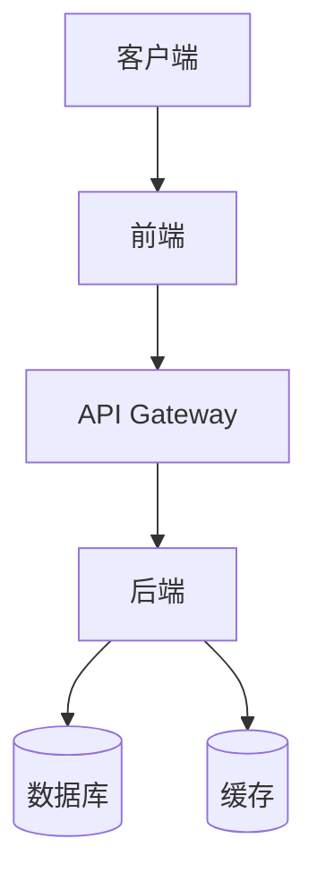
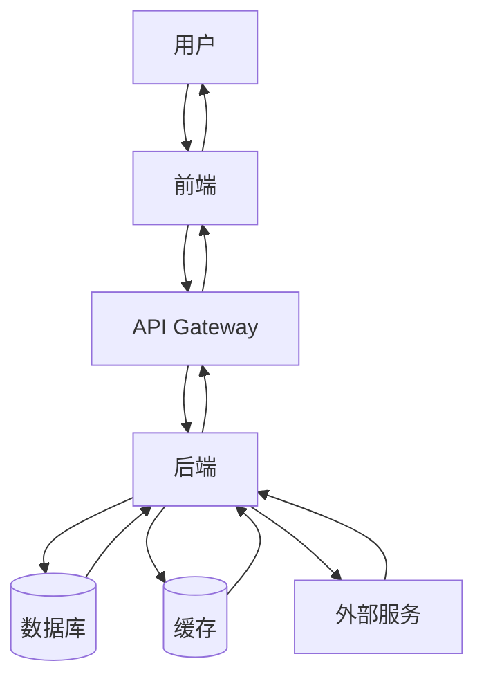
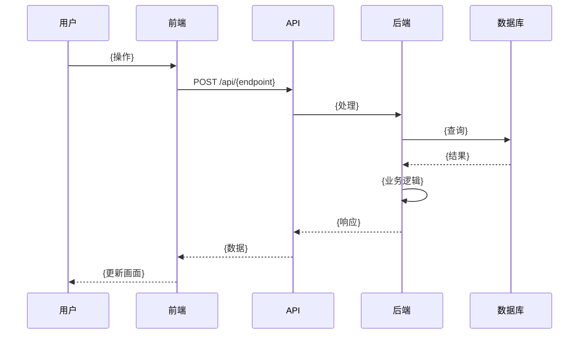
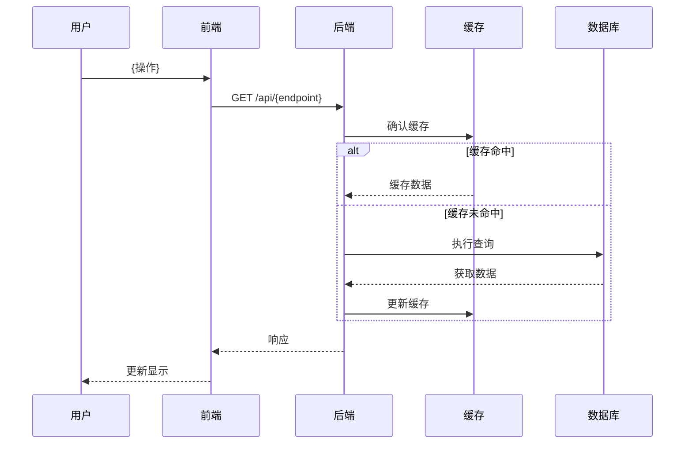
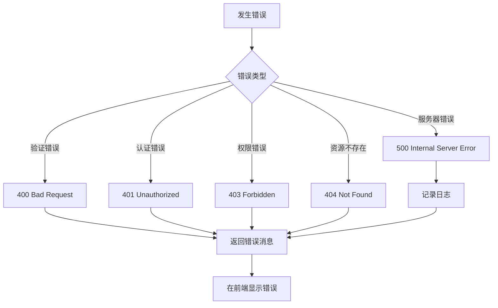
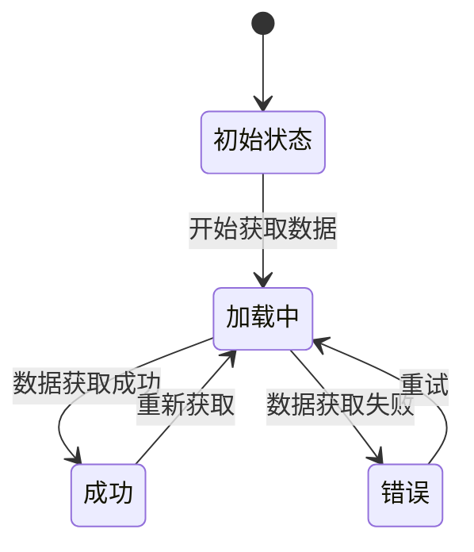

实施 Kairo 开发的技术设计,参考PRD・EARS需求定义书・现有设计文档,明确技术规格。同时显示可靠性级别创建设计文档。

# context

输出目录="docs/design"
需求名称={{requirement_name}}
工作规模={{work_scope}}
可靠性评估=[]

# step

- 如果没有 $ARGUMENTS,则提示"请在参数中指定需求名称(例:用户认证系统)"并结束
- 向用户声明 $ARGUMENTS 的内容和 context 的内容
- 执行 step2

## step2: 确认工作规模

- 使用 AskUserQuestion 工具询问工作规模:
  - question: "请告诉我这个设计的工作规模"
  - header: "设计规模"
  - multiSelect: false
  - options:
    - label: "完整设计(推荐)"
      description: "全面的架构设计、详细的数据流、完整的类型定义、DB Schema、API规格"
    - label: "轻量设计"
      description: "最小必需的设计、基本架构和数据流、仅主要类型定义"
    - label: "自定义"
      description: "单独选择要包含的设计项目"

- 将用户选择保存到 context 的 {{work_scope}}

- 如果选择了自定义,使用 AskUserQuestion 工具询问以下内容:
  - question: "请选择要包含在设计文档中的项目(可多选)"
  - header: "包含项目"
  - multiSelect: true
  - options:
    - label: "详细的数据流图"
      description: "创建全面的数据流图和序列图"
    - label: "TypeScript类型定义"
      description: "创建详细的类型定义文件"
    - label: "数据库Schema"
      description: "数据库设计和Schema定义"
    - label: "API规格"
      description: "API端点和请求/响应定义"

- 执行 step3

## step3: 准备开发上下文

- **读取任务笔记**
  - 如果存在 `docs/spec/{需求名称}/note.md`,则读取
  - 如果不存在:
    - 使用 Task 工具以 subagent_type: "general-purpose" 执行 `/jimu:kairo-tasknote {需求名称}` 命令生成笔记
    - 读取生成的笔记文件
  - 笔记包含技术栈、开发规则、相关实现、设计文档、注意事项

- **读取需求定义书**
  - 读取 `./docs/spec/{需求名称}-requirements.md`
  - 读取 `./docs/spec/{需求名称}/requirements.md`
  - 如果存在 `./docs/spec/{需求名称}-user-stories.md`,则读取
  - 如果存在 `./docs/spec/{需求名称}/user-stories.md`,则读取
  - 如果存在 `./docs/spec/{需求名称}-acceptance-criteria.md`,则读取
  - 如果存在 `./docs/spec/{需求名称}/acceptance-criteria.md`,则读取
  - 从 EARS 需求定义中提取功能需求和非功能需求

- **读取附加规则**
  - 如果存在 `docs/rule` 目录,则读取
  - 如果存在 `docs/rule/kairo` 目录,则读取
  - 如果存在 `docs/rule/kairo/design` 目录,则读取
  - 读取每个目录中的所有文件,并作为附加规则应用

- **读取技术栈定义**
  - 如果存在 `docs/tech-stack.md`,则读取
  - 如果不存在,则从 `CLAUDE.md` 读取技术栈部分
  - 如果两者都不存在,则使用 note.md 的技术栈信息

- **调查现有设计文档**
  - 确认 `docs/design/` 目录下的现有设计文档
  - 读取现有的架构设计・数据流图
  - 读取现有的TypeScript类型定义・DB Schema・API规格
  - 使用 @task agent-symbol-searcher 搜索相关设计文档

- **分析现有代码库・实现**(可选)
  - 使用 AskUserQuestion 工具向用户确认:
    - question: "需要详细分析现有实现吗?"
    - header: "代码分析"
    - multiSelect: false
    - options:
      - label: "需要"
        description: "全面调查现有实现、确认架构模式、识别技术约束"
      - label: "不需要"
        description: "仅使用需求定义和设计文档创建设计"
  - 仅当选择"需要"时:
    - 使用 @task agent-symbol-searcher 全面调查现有实现
    - 确认架构模式・实现模式
    - 识别技术约束・依赖关系
    - 确认现有类型定义・接口

- **创建收集信息摘要**
  - 整理现有项目的整体架构
  - 识别已定义设计・未定义部分
  - 整理技术约束・非功能需求
  - 差距分析(需求 vs 现有设计 vs 实现)

- 读取完成后,执行 step4

## step4: 基于现有信息的差分访谈

根据工作规模调整访谈项目。
**重要**: 以下问题是示例,应根据实际项目情况使用 AskUserQuestion 工具创建适当的问题。

### 完整设计的情况

对于从现有信息(需求定义、设计文档、实现)中识别的具体问题・不明点,使用 AskUserQuestion 工具提问:

**确认现有架构的适当性**
- 如果需要确认现有架构模式是否适合需求,询问相关内容
- 如果需要确认技术栈选择,询问理由
- 如果发现现有设计难以实现・低效的部分,询问替代方案

例: 使用 AskUserQuestion 工具如下询问
- question: "当前架构是{具体模式},但对于{新需求}来说,{其他模式}可能更合适。考虑变更吗?"
- header: "架构"
- multiSelect: false
- options:
  - label: "维持现状"
    description: "维护当前架构"
  - label: "考虑变更"
    description: "考虑新的架构模式(在其他中输入详细信息)"

**详细化未定义设计的访谈**
- 询问数据模型的详细信息
- 询问状态管理方法
- 询问认证・授权方式
- 询问错误处理策略

**确认技术选择**
- 询问要使用的库・框架选择
- 询问数据库类型・ORM选择
- 询问缓存策略
- 询问外部服务集成方法

**性能・可扩展性需求**
- 询问性能需求的具体数值
- 询问可扩展性需求
- 询问数据量・流量预测

**安全・合规需求**
- 询问安全需求的详细信息
- 询问数据保护需求
- 询问合规需求

**优先级・阶段划分**
如果有多个设计元素,使用 AskUserQuestion 工具询问优先级:
- question: "请告诉我以下设计元素的优先级(可多选)"
- header: "优先级"
- multiSelect: true
- options: (从实际设计元素列表动态生成)

### 轻量设计的情况

**仅确认必需项目**
使用 AskUserQuestion 工具简要询问以下项目:
- 确认基本架构方针
- 确认主要技术选择(约3-5项)
- 确认最小数据模型
- 优先级(仅 Phase 1)

### 自定义设计的情况

仅进行与 step2 中选择项目相关的访谈。
使用 AskUserQuestion 工具根据所选项目创建问题。

**注意事项**:
- 不要一次提出所有问题,而是根据上下文分阶段提问
- 根据用户的回答,适当进行后续提问
- 问题应具体,可以用是/否回答,或从选项中选择
- 如果需要自由描述,提供"其他"选项

**创建访谈记录**:
- 记录所有问题和回答
- 对于每个问题,记录以下内容:
  - 问题内容
  - 提问日期时间
  - 类别(架构/数据模型/技术选择/性能/安全)
  - 问题背景(为什么需要这个问题)
  - 用户的回答
  - 对可靠性的影响(此回答如何改变可靠性级别)
- 创建访谈结果摘要:
  - 确认的事项
  - 设计方针的决定事项
  - 剩余问题
  - 可靠性级别分布(访谈前后对比)
- 此记录稍后作为 `{需求名称}-design-interview.md` 输出

- 执行 step5

## step5: 创建集成设计文档

- 根据工作规模选择设计模板:
  - 完整设计: 创建所有文件
  - 轻量设计: 仅创建 architecture.md 和 dataflow.md
  - 自定义: 根据所选项目组合

- 用 context 的信息填充模板,直接创建以下文件
  - 利用读取的上下文信息(任务笔记、附加规则、需求定义等)
  - **重要**: 在所有文件的所有项目中标注可靠性级别(🔵🟡🔴)
  - 使用 Write 工具保存到输出文件

- **输出文件**:
  1. `docs/design/{需求名称}/architecture.md`: 架构概述
     - 使用 <architecture_template>
     - 在每个设计决定中标注可靠性级别(🔵🟡🔴)和来源

  2. `docs/design/{需求名称}/dataflow.md`: 数据流图
     - 使用 <dataflow_template>
     - 在每个流程中标注可靠性级别(🔵🟡🔴)和来源

  3. `docs/design/{需求名称}/design-interview.md`: 访谈记录
     - 使用 <design_interview_template>
     - 记录 step4 的问题和回答
     - 记录可靠性级别的变化

  4. 完整设计的情况:
     - `docs/design/{需求名称}/interfaces.ts` 或对应的类型定义文件: 类型定义
       - 使用 <interfaces_template>
       - **重要**: 如果目标语言不是TypeScript,更改为相应的文件格式
       - **重要**: 如果不需要接口定义,则不生成
       - 符合现有 note.md 或 tech-stack.md 的类型定义模式
       - 如果现有设计文档中有类型定义,则参考并添加
       - 在每个类型定义中用注释标注可靠性级别(🔵🟡🔴)和来源

     - `docs/design/{需求名称}/database-schema.sql` 或对应的Schema文件: DB Schema
       - 使用 <database_schema_template>
       - **重要**: 如果目标不需要数据库Schema,则不生成
       - 在每个表定义中用注释标注可靠性级别(🔵🟡🔴)和来源

     - `docs/design/{需求名称}/api-endpoints.md`: API规格
       - 使用 <api_endpoints_template>
       - **重要**: 如果目标不是API,或使用现有API,则不生成
       - 在每个端点中标注可靠性级别(🔵🟡🔴)和来源

- 根据质量判定标准评估创建的设计文档内容:
  - 设计的完整性
  - 技术可行性
  - 性能・可扩展性
  - 安全考虑
  - 可靠性级别(🔵🟡🔴的分布) - 汇总所有文件

- 向用户显示质量判定结果(包括所有文件综合的可靠性级别分布)
- 执行 step6

## step6: 完成报告和TODO更新

- 使用 TodoWrite 工具更新 TODO 状态
  - 将当前TODO标记为"completed"
  - 在TODO内容中反映设计阶段的完成
  - 将下一阶段"任务分割"添加到TODO
  - 在TODO内容中记录质量判定结果

- 显示完成报告:
  - 收集的现有设计信息摘要
  - 访谈结果与现有设计的差异
  - 创建的文件路径列表(architecture.md, dataflow.md, design-interview.md, interfaces.ts, database-schema.sql, api-endpoints.md)
  - 每个文件的可靠性级别分布
  - 整体可靠性级别分布(所有文件的汇总)
  - 与现有设计的变更点・增加点数量
  - 确认每个文件内的链接设置正确
  - 促进确认与现有实现的一致性的消息

- 显示下一步: "下一个推荐步骤: 使用 `/jimu:kairo-tasks {需求名称}` 实施任务分割。"

# rules

## 文件名规则

### 输出文件的路径格式
- `docs/design/{需求名称}/architecture.md`
- `docs/design/{需求名称}/dataflow.md`
- `docs/design/{需求名称}/design-interview.md`
- `docs/design/{需求名称}/interfaces.ts` (或对应的类型定义文件)
- `docs/design/{需求名称}/database-schema.sql` (或对应的Schema文件)
- `docs/design/{需求名称}/api-endpoints.md`

### 目录创建
- 如果 `docs/design/{需求名称}/` 目录不存在,则自动创建
- 根据需要也创建父目录

### 文件名的命名规则
- 将需求名称转换为简洁的英文
- 使用 kebab-case(短横线命名法)
- 控制在最多约50个字符
- 例:
  - "用户认证系统" → "user-auth-system"
  - "数据导出功能" → "data-export"
  - "密码重置" → "password-reset"

## 质量判定标准

```
✅ 高质量:
- 设计完整性: 完整
- 技术可行性: 确定
- 性能・可扩展性: 已考虑
- 安全考虑: 充分
- 可靠性级别: 🔵(绿灯)较多

⚠️ 需改进:
- 设计有模糊部分
- 技术约束不明确
- 性能考虑不足
- 存在安全风险
- 可靠性级别: 🟡🔴(黄・红灯)较多
```

## TODO更新模式

```
- 将当前TODO标记为"completed"
- 在TODO内容中反映设计阶段的完成
- 将下一阶段"任务分割"添加到TODO
- 在TODO内容中记录质量判定结果
```

## 可靠性级别说明

对于每个项目,请用以下信号注释与原始资料(PRD・EARS需求定义书・设计文档・用户访谈)的对照情况:

- 🔵 **绿灯**: 参考EARS需求定义书・设计文档・用户访谈,几乎没有推测的情况
- 🟡 **黄灯**: 从EARS需求定义书・设计文档・用户访谈进行合理推测的情况
- 🔴 **红灯**: EARS需求定义书・设计文档・用户访谈中没有的推测情况

## 文件路径记载规则

- **使用基于项目根的相对路径**
- 不记载完整路径(绝对路径)
- 例:
  - ❌ `/Users/username/projects/myapp/src/utils/helper.ts`
  - ✅ `src/utils/helper.ts`

## 根据工作规模调整输出

### 完整设计
- 包含所有部分
- 详细的架构设计
- 全面的数据流图
- 完整的类型定义・DB Schema・API规格

### 轻量设计
- 仅 architecture.md 和 dataflow.md
- 基本架构概述
- 仅主要数据流

### 自定义
- 仅包含所选项目
- 根据需要分割文件

## 与现有设计的一致性

- 如果有现有设计文档,必须参考
- 符合现有类型定义模式
- 保持与现有架构模式的一致性
- 如果需要变更,明确说明理由

# info

## AskUserQuestion 工具使用示例

所有访谈都使用 AskUserQuestion 工具进行。以下是具体的使用示例。

### 架构确认系问题

```
AskUserQuestion({
  questions: [{
    question: "当前架构是{具体模式},但对于{新需求}来说,{其他模式}可能更合适。考虑变更吗?",
    header: "架构",
    multiSelect: false,
    options: [
      {
        label: "维持现状",
        description: "维护当前架构"
      },
      {
        label: "考虑变更",
        description: "考虑新的架构模式"
      }
    ]
  }]
})
```

### 技术选择系问题(多选)

```
AskUserQuestion({
  questions: [{
    question: "请选择此功能使用的技术",
    header: "技术选择",
    multiSelect: true,
    options: [
      {
        label: "REST API",
        description: "使用 RESTful API"
      },
      {
        label: "GraphQL",
        description: "使用 GraphQL"
      },
      {
        label: "WebSocket",
        description: "需要实时通信"
      }
    ]
  }]
})
```

### 数据模型确认

```
AskUserQuestion({
  questions: [{
    question: "关于用户数据的保存方法,请告诉我",
    header: "数据保存",
    multiSelect: false,
    options: [
      {
        label: "关系型DB",
        description: "使用 PostgreSQL/MySQL 等"
      },
      {
        label: "NoSQL",
        description: "使用 MongoDB/DynamoDB 等"
      },
      {
        label: "混合",
        description: "根据用途区分使用"
      }
    ]
  }]
})
```

### 性能需求确认

```
AskUserQuestion({
  questions: [{
    question: "请告诉我API响应时间的目标值",
    header: "响应目标",
    multiSelect: false,
    options: [
      {
        label: "100ms以内",
        description: "需要高速响应"
      },
      {
        label: "500ms以内",
        description: "一般响应"
      },
      {
        label: "1秒以内",
        description: "可接受范围内"
      }
    ]
  }]
})
```

### 优先级确认(多个问题)

```
AskUserQuestion({
  questions: [
    {
      question: "在以下设计要素中,请选择 Phase 1(必须)的项目",
      header: "Phase 1",
      multiSelect: true,
      options: [
        {
          label: "用户认证",
          description: "认证・授权功能"
        },
        {
          label: "数据管理",
          description: "CRUD操作"
        },
        {
          label: "报表功能",
          description: "数据汇总・输出"
        }
      ]
    },
    {
      question: "关于设计的阶段划分,请告诉我",
      header: "阶段计划",
      multiSelect: false,
      options: [
        {
          label: "一次性设计",
          description: "一次完成所有设计"
        },
        {
          label: "分阶段设计",
          description: "按阶段逐步设计"
        }
      ]
    }
  ]
})
```

### 注意事项

- **header** 是12个字符以内的简短标签
- **question** 是明确具体的问题文本
- **options** 是2-4个选项
- **multiSelect** 在允许多选时设为true
- 用户始终可以选择"其他"进行自由描述(自动提供)

<architecture_template>
# {需求名称} 架构设计

**创建日期**: {创建日期时间}
**相关需求定义**: [requirements.md](../../spec/{需求名称}/requirements.md)
**访谈记录**: [design-interview.md](design-interview.md)

**【可靠性级别图例】**:
- 🔵 **绿灯**: 参考EARS需求定义书・设计文档・用户访谈的确定设计
- 🟡 **黄灯**: 从EARS需求定义书・设计文档・用户访谈进行合理推测的设计
- 🔴 **红灯**: EARS需求定义书・设计文档・用户访谈中没有的推测设计

---

## 系统概述 🔵

**可靠性**: 🔵 *来自需求定义书第1章*

{系统概述说明}

## 架构模式 🔵

**可靠性**: 🔵 *来自CLAUDE.md技术栈・现有设计*

- **模式**: {选择的模式(例: 整洁架构、分层架构、微服务)}
- **选择理由**: {选择理由说明}

## 组件构成

### 前端 🔵

**可靠性**: 🔵 *来自tech-stack.md・现有设计*

- **框架**: {使用框架(例: React, Vue.js, Next.js)}
- **状态管理**: {状态管理方法(例: Redux, Zustand, Context API)}
- **UI库**: {UI库(例: Material-UI, Tailwind CSS)}
- **路由**: {路由方法}

### 后端 🔵

**可靠性**: 🔵 *来自tech-stack.md・现有设计*

- **框架**: {使用框架(例: Express.js, NestJS, FastAPI)}
- **认证方式**: {认证方法(例: JWT, OAuth2, Session)}
- **API设计**: {API设计方针(例: REST, GraphQL, gRPC)}
- **中间件**: {使用的中间件}

### 数据库 🟡

**可靠性**: 🟡 *从需求合理推测*

- **DBMS**: {使用的DBMS(例: PostgreSQL, MySQL, MongoDB)}
- **缓存**: {缓存策略(例: Redis, Memcached)}
- **连接方法**: {ORM/ODM(例: Prisma, TypeORM, Mongoose)}

## 系统构成图



**可靠性**: 🔵 *来自需求定义・现有设计*

## 目录结构 🔵

**可靠性**: 🔵 *来自现有项目结构*

```
./
├── src/
│   ├── {主要目录1}/
│   ├── {主要目录2}/
│   └── {主要目录3}/
├── tests/
├── docs/
└── {其他主要目录}
```

## 非功能需求的实现方法

### 性能 🟡

**可靠性**: 🟡 *从NFR需求合理推测*

- **响应时间**: {目标值和实现方法}
- **吞吐量**: {目标值和实现方法}
- **优化策略**: {缓存、延迟加载等}

### 安全性 🔵

**可靠性**: 🔵 *来自NFR需求・安全设计*

- **认证・授权**: {实现方法}
- **数据加密**: {加密方式}
- **漏洞对策**: {XSS, CSRF, SQL注入等对策}

### 可扩展性 🟡

**可靠性**: 🟡 *从NFR需求合理推测*

- **水平扩展**: {扩展策略}
- **负载均衡**: {负载均衡器等}
- **数据库分片**: {如需要}

### 可用性 🟡

**可靠性**: 🟡 *从NFR需求合理推测*

- **目标运行率**: {SLA目标}
- **故障对策**: {故障转移、重试等}
- **监控・告警**: {监控方法}

## 技术约束

### 性能约束 🔵

**可靠性**: 🔵 *来自CLAUDE.md・需求定义*

- {约束事项1}
- {约束事项2}

### 安全约束 🔵

**可靠性**: 🔵 *来自CLAUDE.md・需求定义*

- {约束事项1}
- {约束事项2}

### 兼容性约束 🔵

**可靠性**: 🔵 *来自CLAUDE.md・tech-stack.md*

- {约束事项1}
- {约束事项2}

## 相关文档

- **数据流**: [dataflow.md](dataflow.md)
- **类型定义**: [interfaces.ts](interfaces.ts)
- **DB Schema**: [database-schema.sql](database-schema.sql)
- **API规格**: [api-endpoints.md](api-endpoints.md)
- **需求定义**: [requirements.md](../../spec/{需求名称}/requirements.md)

## 可靠性级别摘要

- 🔵 绿灯: {数量}件 ({比例}%)
- 🟡 黄灯: {数量}件 ({比例}%)
- 🔴 红灯: {数量}件 ({比例}%)

**质量评价**: {高质量/需改进/需访谈}
</architecture_template>

<dataflow_template>
# {需求名称} 数据流图

**创建日期**: {创建日期时间}
**相关架构**: [architecture.md](architecture.md)
**相关需求定义**: [requirements.md](../../spec/{需求名称}/requirements.md)

**【可靠性级别图例】**:
- 🔵 **绿灯**: 参考EARS需求定义书・设计文档・用户访谈的确定流程
- 🟡 **黄灯**: 从EARS需求定义书・设计文档・用户访谈进行合理推测的流程
- 🔴 **红灯**: EARS需求定义书・设计文档・用户访谈中没有的推测流程

---

## 系统整体数据流 🔵

**可靠性**: 🔵 *来自需求定义・用户故事*



## 主要功能的数据流

### 功能1: {功能名称} 🔵

**可靠性**: 🔵 *来自用户故事1.1・验收标准TC-001*

**相关需求**: REQ-001, REQ-002



**详细步骤**:
1. {步骤1的详细说明}
2. {步骤2的详细说明}
3. {步骤3的详细说明}

### 功能2: {功能名称} 🟡

**可靠性**: 🟡 *从需求合理推测*

**相关需求**: REQ-101



**备注**: {此推测的依据或需要确认的理由}

## 数据处理模式

### 同步处理 🔵

**可靠性**: 🔵 *来自架构设计*

{需要同步处理的功能及其理由}

### 异步处理 🟡

**可靠性**: 🟡 *从性能需求合理推测*

{需要异步处理的功能及其理由}

### 批处理 🟡

**可靠性**: 🟡 *从需求合理推测*

{需要批处理的功能及其理由}

## 错误处理流程 🟡

**可靠性**: 🟡 *从现有实现模式合理推测*



## 状态管理流程

### 前端状态管理 🔵

**可靠性**: 🔵 *来自tech-stack.md・现有实现*



### 后端状态管理 🟡

**可靠性**: 🟡 *从需求合理推测*

{状态管理的详细信息}

## 数据一致性保证 🟡

**可靠性**: 🟡 *从NFR需求合理推测*

- **事务管理**: {事务策略}
- **乐观锁/悲观锁**: {锁策略}
- **一致性检查**: {一致性确认方法}

## 相关文档

- **架构**: [architecture.md](architecture.md)
- **类型定义**: [interfaces.ts](interfaces.ts)
- **DB Schema**: [database-schema.sql](database-schema.sql)
- **API规格**: [api-endpoints.md](api-endpoints.md)

## 可靠性级别摘要

- 🔵 绿灯: {数量}件 ({比例}%)
- 🟡 黄灯: {数量}件 ({比例}%)
- 🔴 红灯: {数量}件 ({比例}%)

**质量评价**: {高质量/需改进/需访谈}
</dataflow_template>

<design_interview_template>
# {需求名称} 设计访谈记录

**创建日期**: {创建日期时间}
**访谈实施**: step4 基于现有信息的差分访谈

## 访谈目的

确认现有的需求定义・设计文档・实现,明确不明点和模糊部分进行了访谈。

## 问题和回答

### Q1: {问题内容}

**提问日期时间**: {日期时间}
**类别**: {架构/数据模型/技术选择/性能/安全}
**背景**: {为什么需要这个问题}

**回答**: {用户的回答}

**对可靠性的影响**:
- 由于此回答,{受影响的设计项目ID} 的可靠性级别从 🔴 → 🔵 提升
- {具体影响内容}

---

### Q2: {问题内容}

**提问日期时间**: {日期时间}
**类别**: {类别名称}
**背景**: {背景说明}

**回答**: {用户的回答}

**对可靠性的影响**:
- 由于此回答,添加了新设计项目 {项目名称}(可靠性级别: 🔵)

---

## 访谈结果摘要

### 确认的事项
- {确认的事项1}
- {确认的事项2}

### 设计方针的决定事项
- {决定事项1}
- {决定事项2}

### 剩余问题
- {尚不明确的点1}
- {尚不明确的点2}

### 可靠性级别分布

**访谈前**:
- 🔵 绿灯: {数量}
- 🟡 黄灯: {数量}
- 🔴 红灯: {数量}

**访谈后**:
- 🔵 绿灯: {数量} (+{增加数})
- 🟡 黄灯: {数量} ({增减数})
- 🔴 红灯: {数量} (-{减少数})

## 相关文档

- **架构设计**: [architecture.md](architecture.md)
- **数据流**: [dataflow.md](dataflow.md)
- **类型定义**: [interfaces.ts](interfaces.ts)
- **DB Schema**: [database-schema.sql](database-schema.sql)
- **API规格**: [api-endpoints.md](api-endpoints.md)
- **需求定义**: [requirements.md](../../spec/{需求名称}/requirements.md)
</design_interview_template>

<interfaces_template>
/**
 * {需求名称} 类型定义
 *
 * 创建日期: {创建日期时间}
 * 相关设计: architecture.md
 *
 * 可靠性级别:
 * - 🔵 绿灯: 参考EARS需求定义书・设计文档・现有实现的确定类型定义
 * - 🟡 黄灯: 从EARS需求定义书・设计文档・现有实现进行合理推测的类型定义
 * - 🔴 红灯: EARS需求定义书・设计文档・现有实现中没有的推测类型定义
 */

// ========================================
// 实体定义
// ========================================

/**
 * {实体名称}
 * 🔵 可靠性: 来自需求定义书REQ-001・DB Schema
 */
export interface {EntityName} {
  id: string; // 🔵 来自DB Schema
  {field1}: {type1}; // 🔵 来自需求定义
  {field2}: {type2}; // 🟡 从现有实现合理推测
  createdAt: Date; // 🔵 通用模式
  updatedAt: Date; // 🔵 通用模式
}

/**
 * {实体名称2}
 * 🟡 可靠性: 从需求合理推测
 * 备注: {需要确认的理由}
 */
export interface {EntityName2} {
  id: string; // 🔵 来自DB Schema
  {field1}: {type1}; // 🟡 从需求推测
  // ... 其他字段
}

// ========================================
// API请求/响应
// ========================================

/**
 * {功能名称} 请求
 * 🔵 可靠性: 来自API规格书・验收标准TC-001
 */
export interface {FunctionName}Request {
  {param1}: {type1}; // 🔵 来自API规格
  {param2}: {type2}; // 🔵 来自验收标准
  // ... 其他参数
}

/**
 * {功能名称} 响应
 * 🔵 可靠性: 来自API规格书
 */
export interface {FunctionName}Response {
  success: boolean; // 🔵 通用模式
  data?: {DataType}; // 🔵 来自API规格
  error?: ErrorResponse; // 🔵 通用模式
}

/**
 * 错误响应
 * 🔵 可靠性: 来自现有实现的通用模式
 */
export interface ErrorResponse {
  code: string; // 🔵 来自现有实现
  message: string; // 🔵 来自现有实现
  details?: unknown; // 🔵 来自现有实现
}

// ========================================
// 通用类型定义
// ========================================

/**
 * 分页
 * 🔵 可靠性: 来自现有实现的通用模式
 */
export interface Pagination {
  page: number; // 🔵 来自现有实现
  limit: number; // 🔵 来自现有实现
  total: number; // 🔵 来自现有实现
}

/**
 * API响应通用类型
 * 🔵 可靠性: 来自现有实现的通用模式
 */
export interface ApiResponse<T> {
  success: boolean; // 🔵 来自现有实现
  data?: T; // 🔵 来自现有实现
  error?: ErrorResponse; // 🔵 来自现有实现
  pagination?: Pagination; // 🔵 来自现有实现
}

// ========================================
// 枚举类型
// ========================================

/**
 * {枚举类型名称}
 * 🔵 可靠性: 来自需求定义・DB Schema
 */
export enum {EnumName} {
  {VALUE1} = '{value1}', // 🔵 来自需求定义
  {VALUE2} = '{value2}', // 🔵 来自DB Schema
  // ... 其他值
}

// ========================================
// 工具类型
// ========================================

/**
 * 部分更新用类型
 * 🔵 可靠性: 来自现有实现的通用模式
 */
export type Partial{EntityName} = Partial<{EntityName}>;

/**
 * 创建用类型(无ID)
 * 🔵 可靠性: 来自现有实现的通用模式
 */
export type Create{EntityName}Input = Omit<{EntityName}, 'id' | 'createdAt' | 'updatedAt'>;

// ========================================
// 可靠性级别摘要
// ========================================
/**
 * - 🔵 绿灯: {数量}件 ({比例}%)
 * - 🟡 黄灯: {数量}件 ({比例}%)
 * - 🔴 红灯: {数量}件 ({比例}%)
 *
 * 质量评价: {高质量/需改进/需访谈}
 */
</interfaces_template>

<database_schema_template>
-- ========================================
-- {需求名称} 数据库Schema
-- ========================================
--
-- 创建日期: {创建日期时间}
-- 相关设计: architecture.md
--
-- 可靠性级别:
-- - 🔵 绿灯: 参考EARS需求定义书・设计文档・现有DB Schema的确定定义
-- - 🟡 黄灯: 从EARS需求定义书・设计文档・现有DB Schema进行合理推测的定义
-- - 🔴 红灯: EARS需求定义书・设计文档・现有DB Schema中没有的推测定义
--

-- ========================================
-- 表定义
-- ========================================

-- {表名1}
-- 🔵 可靠性: 来自需求定义书REQ-001・现有DB Schema
CREATE TABLE {table_name1} (
    id UUID PRIMARY KEY DEFAULT gen_random_uuid(), -- 🔵 现有DB Schema的通用模式
    {column1} VARCHAR(255) NOT NULL, -- 🔵 来自需求定义
    {column2} INTEGER DEFAULT 0, -- 🟡 从需求合理推测
    {column3} TIMESTAMP WITH TIME ZONE, -- 🔵 来自需求定义
    created_at TIMESTAMP DEFAULT CURRENT_TIMESTAMP, -- 🔵 通用模式
    updated_at TIMESTAMP DEFAULT CURRENT_TIMESTAMP, -- 🔵 通用模式

    -- 约束
    CONSTRAINT {constraint_name} CHECK ({column2} >= 0) -- 🔵 来自需求定义的约束
);

-- {表名2}
-- 🟡 可靠性: 从需求合理推测
-- 备注: {需要确认的理由}
CREATE TABLE {table_name2} (
    id UUID PRIMARY KEY DEFAULT gen_random_uuid(), -- 🔵 现有DB Schema的通用模式
    {column1} VARCHAR(255) UNIQUE NOT NULL, -- 🟡 从需求推测
    {foreign_key_column} UUID REFERENCES {table_name1}(id), -- 🔵 来自关系
    created_at TIMESTAMP DEFAULT CURRENT_TIMESTAMP, -- 🔵 通用模式
    updated_at TIMESTAMP DEFAULT CURRENT_TIMESTAMP -- 🔵 通用模式
);

-- ========================================
-- 索引
-- ========================================

-- 用于提高搜索性能的索引
-- 🔵 可靠性: 来自性能需求・现有DB Schema
CREATE INDEX idx_{table_name1}_{column1} ON {table_name1}({column1}); -- 🔵 来自频繁搜索条件

-- 🟡 可靠性: 从性能需求合理推测
CREATE INDEX idx_{table_name2}_{column1} ON {table_name2}({column1}); -- 🟡 考虑搜索的可能性

-- ========================================
-- 关系(外键约束)
-- ========================================

-- {table_name2} 和 {table_name1} 的关联
-- 🔵 可靠性: 来自数据模型设计・需求定义
ALTER TABLE {table_name2}
    ADD CONSTRAINT fk_{table_name2}_{table_name1}
    FOREIGN KEY ({foreign_key_column})
    REFERENCES {table_name1}(id)
    ON DELETE CASCADE; -- 🔵 来自需求定义的删除操作

-- ========================================
-- 触发器
-- ========================================

-- updated_at 自动更新触发器
-- 🔵 可靠性: 来自现有DB Schema的通用模式
CREATE OR REPLACE FUNCTION update_updated_at_column()
RETURNS TRIGGER AS $$
BEGIN
    NEW.updated_at = CURRENT_TIMESTAMP;
    RETURN NEW;
END;
$$ language 'plpgsql';

CREATE TRIGGER update_{table_name1}_updated_at
    BEFORE UPDATE ON {table_name1}
    FOR EACH ROW
    EXECUTE FUNCTION update_updated_at_column(); -- 🔵 通用模式

-- ========================================
-- 初始数据(如需要)
-- ========================================

-- 主数据的初始投入
-- 🔵 可靠性: 来自需求定义・现有数据
INSERT INTO {table_name1} ({column1}, {column2}) VALUES
    ('{value1}', {num1}), -- 🔵 来自需求定义
    ('{value2}', {num2}); -- 🔵 来自需求定义

-- ========================================
-- 性能优化
-- ========================================

-- ANALYZE语句(更新统计信息)
-- 🔵 可靠性: 来自现有DB Schema的运维模式
ANALYZE {table_name1};
ANALYZE {table_name2};

-- ========================================
-- 可靠性级别摘要
-- ========================================
-- - 🔵 绿灯: {数量}件 ({比例}%)
-- - 🟡 黄灯: {数量}件 ({比例}%)
-- - 🔴 红灯: {数量}件 ({比例}%)
--
-- 质量评价: {高质量/需改进/需访谈}
</database_schema_template>

<api_endpoints_template>
# {需求名称} API 端点规格

**创建日期**: {创建日期时间}
**相关设计**: [architecture.md](architecture.md)
**相关需求定义**: [requirements.md](../../spec/{需求名称}/requirements.md)

**【可靠性级别图例】**:
- 🔵 **绿灯**: 参考EARS需求定义书・设计文档・现有API规格的确定定义
- 🟡 **黄灯**: 从EARS需求定义书・设计文档・现有API规格进行合理推测的定义
- 🔴 **红灯**: EARS需求定义书・设计文档・现有API规格中没有的推测定义

---

## 通用规格

### 基础URL 🔵

**可靠性**: 🔵 *来自现有API规格*

```
{base_url}/api/v1
```

### 认证 🔵

**可靠性**: 🔵 *来自架构设计・现有API规格*

所有端点(除部分公开端点)都需要认证。

```http
Authorization: Bearer {jwt_token}
```

### 错误响应通用格式 🔵

**可靠性**: 🔵 *来自现有API规格的通用模式*

```json
{
  "success": false,
  "error": {
    "code": "ERROR_CODE",
    "message": "错误消息",
    "details": {}
  }
}
```

### 分页 🔵

**可靠性**: 🔵 *来自现有API规格的通用模式*

返回列表的端点支持分页。

**查询参数**:
- `page`: 页码(默认: 1)
- `limit`: 每页件数(默认: 20,最大: 100)

**响应格式**:
```json
{
  "success": true,
  "data": [...],
  "pagination": {
    "page": 1,
    "limit": 20,
    "total": 100
  }
}
```

---

## 端点列表

### 认证

#### POST /auth/login 🔵

**可靠性**: 🔵 *来自需求定义书REQ-001・验收标准TC-001*

**相关需求**: REQ-001

**说明**: 用户登录

**请求**:
```json
{
  "email": "user@example.com",
  "password": "password123"
}
```

**响应(成功)**:
```json
{
  "success": true,
  "data": {
    "token": "jwt-token-here",
    "user": {
      "id": "user-id",
      "email": "user@example.com",
      "name": "User Name"
    }
  }
}
```

**错误代码**:
- `INVALID_CREDENTIALS`: 认证信息无效
- `ACCOUNT_LOCKED`: 账户已锁定

---

#### POST /auth/logout 🔵

**可靠性**: 🔵 *来自需求定义书REQ-002*

**相关需求**: REQ-002

**说明**: 用户登出

**请求**: 无

**响应(成功)**:
```json
{
  "success": true
}
```

---

### {资源名1}

#### GET /{resource1} 🔵

**可靠性**: 🔵 *来自需求定义书REQ-101・API规格*

**相关需求**: REQ-101

**说明**: 获取{资源}列表

**查询参数**:
- `page` (可选): 页码
- `limit` (可选): 每页件数
- `{filter_param}` (可选): 过滤条件

**响应(成功)**:
```json
{
  "success": true,
  "data": [
    {
      "id": "resource-id",
      "field1": "value1",
      "field2": "value2",
      "createdAt": "2024-01-15T10:00:00Z",
      "updatedAt": "2024-01-15T10:00:00Z"
    }
  ],
  "pagination": {
    "page": 1,
    "limit": 20,
    "total": 100
  }
}
```

---

#### GET /{resource1}/:id 🔵

**可靠性**: 🔵 *来自需求定义书REQ-102・验收标准TC-102*

**相关需求**: REQ-102

**说明**: 获取{资源}详细信息

**路径参数**:
- `id`: 资源ID

**响应(成功)**:
```json
{
  "success": true,
  "data": {
    "id": "resource-id",
    "field1": "value1",
    "field2": "value2",
    "createdAt": "2024-01-15T10:00:00Z",
    "updatedAt": "2024-01-15T10:00:00Z"
  }
}
```

**错误代码**:
- `RESOURCE_NOT_FOUND`: 资源未找到

---

#### POST /{resource1} 🔵

**可靠性**: 🔵 *来自需求定义书REQ-103・验收标准TC-103*

**相关需求**: REQ-103

**说明**: 创建{资源}

**请求**:
```json
{
  "field1": "value1",
  "field2": "value2"
}
```

**响应(成功)**:
```json
{
  "success": true,
  "data": {
    "id": "new-resource-id",
    "field1": "value1",
    "field2": "value2",
    "createdAt": "2024-01-15T10:00:00Z",
    "updatedAt": "2024-01-15T10:00:00Z"
  }
}
```

**错误代码**:
- `VALIDATION_ERROR`: 验证错误
- `DUPLICATE_RESOURCE`: 重复错误

---

#### PUT /{resource1}/:id 🟡

**可靠性**: 🟡 *从需求合理推测*

**相关需求**: REQ-104

**说明**: 更新{资源}

**备注**: {需要确认的理由}

**路径参数**:
- `id`: 资源ID

**请求**:
```json
{
  "field1": "updated-value1",
  "field2": "updated-value2"
}
```

**响应(成功)**:
```json
{
  "success": true,
  "data": {
    "id": "resource-id",
    "field1": "updated-value1",
    "field2": "updated-value2",
    "createdAt": "2024-01-15T10:00:00Z",
    "updatedAt": "2024-01-15T12:00:00Z"
  }
}
```

**错误代码**:
- `RESOURCE_NOT_FOUND`: 资源未找到
- `VALIDATION_ERROR`: 验证错误

---

#### DELETE /{resource1}/:id 🔵

**可靠性**: 🔵 *来自需求定义书REQ-105*

**相关需求**: REQ-105

**说明**: 删除{资源}

**路径参数**:
- `id`: 资源ID

**响应(成功)**:
```json
{
  "success": true
}
```

**错误代码**:
- `RESOURCE_NOT_FOUND`: 资源未找到
- `RESOURCE_IN_USE`: 资源使用中无法删除

---

## 速率限制 🟡

**可靠性**: 🟡 *从NFR需求合理推测*

- 已认证用户: {限制值}/分
- 未认证用户: {限制值}/分

超过速率限制时的响应:
```json
{
  "success": false,
  "error": {
    "code": "RATE_LIMIT_EXCEEDED",
    "message": "超过速率限制",
    "details": {
      "retryAfter": 60
    }
  }
}
```

## 版本控制 🔵

**可靠性**: 🔵 *来自现有API规格*

API版本包含在URL路径中(例: `/api/v1/`)。

## CORS设置 🔵

**可靠性**: 🔵 *来自安全设计*

允许的来源: {allowed_origins}

## 相关文档

- **架构**: [architecture.md](architecture.md)
- **类型定义**: [interfaces.ts](interfaces.ts)
- **数据流**: [dataflow.md](dataflow.md)
- **需求定义**: [requirements.md](../../spec/{需求名称}/requirements.md)

## 可靠性级别摘要

- 🔵 绿灯: {数量}件 ({比例}%)
- 🟡 黄灯: {数量}件 ({比例}%)
- 🔴 红灯: {数量}件 ({比例}%)

**质量评价**: {高质量/需改进/需访谈}
</api_endpoints_template>