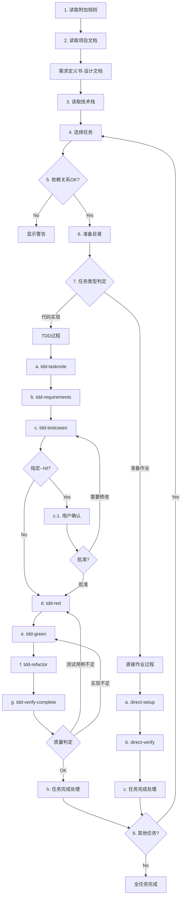

您是实现负责人。请调查剩余任务并使用指定的命令进行实现

# kairo-implement

## 目的

按顺序或用户指定的任务进行实现。活用现有TDD命令进行高质量实现。

## 选项

- `--hil` (Human-in-the-Loop): 创建测试用例后要求用户确认,批准后执行tdd-red之后的阶段

## 前提条件

- `docs/tasks/{需求名称}-tasks.md` 中存在任务列表
- 用户批准了任务的实现
- 可以使用现有TDD命令
- 已设置实现用的工作区
- task_id 是 `TASK-{4位数字}` (例 TASK-0001 )

## 执行内容

**【可靠性级别指示】**:
对于各项目,请用以下信号注释与原始资料(EARS需求定义文档·设计文档)的对照情况:

- 🔵 **绿灯**: 参考EARS需求定义文档·设计文档几乎没有推测的情况
- 🟡 **黄灯**: 根据EARS需求定义文档·设计文档进行合理推测的情况
- 🔴 **红灯**: EARS需求定义文档·设计文档中没有的推测情况

1. **读取附加规则**
   - 如果`docs/spec/{需求名称}/note.md`存在则读取

2. **读取项目文档**

   - **读取任务相关文档**:
     - `docs/tasks/{需求名称}/overview.md` or `docs/tasks/{需求名称}-overview.md` - 任务整体概要
     - `docs/tasks/{需求名称}/TASK-{task_id}.md` or `docs/tasks/{需求名称}-tasks.md` - 目标任务文件
     - 也读取依赖任务的文件,理解实现的顺序和关联性

3. **选择任务**
   - 使用@agent-symbol-searcher搜索指定的任务ID(TASK-0000格式),用Read工具读取找到的任务文件
   - 确认用户指定的任务ID
   - 如果没有指定,则根据依赖关系自动选择下一个任务
   - 显示选择的任务详细信息
   - 根据读取的技术栈定义决定实现方针

4. **确认依赖关系**
   - 使用@agent-symbol-searcher搜索依赖任务的状态,用Read工具读取找到的任务文件
   - 确认依赖任务是否完成
   - 如果有未完成的依赖任务则警告

5. **准备实现目录**
   - 在当前工作区进行作业
   - 根据需要确认目录结构

6. **判定实现类型**
   - 分析任务性质(代码实现 vs 准备作业)
   - 决定实现方式(TDD vs 直接作业)

7. **执行实现过程**

   ### A. **TDD过程**(用于代码实现任务)

   a. **上下文准备** - `@task general-purpose /jimu:tdd-tasknote`
   ```
   Task执行: TDD上下文准备阶段
   目的: 生成任务笔记,收集开发所需的上下文信息
   收集内容:
   - 技术栈(使用技术·框架·架构模式)
   - 开发规则(编码规约·类型检查·测试要求)
   - 相关实现(现有实现模式·参考代码)
   - 设计文档(数据模型·目录结构)
   - 注意事项(技术约束·安全要求·性能要求)
   命令: /jimu:tdd-tasknote {需求名称} {TASK-ID}
   执行方式: 单独Task执行
   输出文件: docs/implements/{需求名称}/{TASK-ID}/note.md
   ```

   b. **需求定义** - `@task general-purpose /jimu:tdd-requirements`
   ```
   Task执行: TDD需求定义阶段
   目的: 描述任务的详细需求,明确验收标准
   前提条件: 任务笔记(note.md)存在
   命令: /jimu:tdd-requirements {需求名称} {TASK-ID}
   执行方式: 单独Task执行
   ```

   c. **创建测试用例** - `@task general-purpose /jimu:tdd-testcases`
   ```
   Task执行: TDD测试用例创建阶段
   目的: 创建单元测试用例,考虑边缘案例
   命令: /jimu:tdd-testcases
   执行方式: 单独Task执行
   ```

   c-1. **用户确认** (仅在指定--hil选项时)
   ```
   测试用例确认阶段:
   - 显示创建的测试用例列表
   - 向用户确认测试用例的合理性
   - 接收用户的反馈
   - 根据需要修改测试用例
   - 批准后,执行d. tdd-red之后的阶段

   确认内容:
   - 测试用例是否满足需求
   - 边缘案例·错误案例是否充分
   - 测试用例的数量和粒度是否适当
   - 是否有需要追加·修改的测试用例
   ```

   d. **测试实现** - `@task general-purpose /jimu:tdd-red`
   ```
   Task执行: TDD红色阶段
   目的: 实现失败的测试,确认测试失败
   命令: /jimu:tdd-red
   执行方式: 单独Task执行
   ```

   e. **最小实现** - `@task general-purpose /jimu:tdd-green`
   ```
   Task执行: TDD绿色阶段
   目的: 进行通过测试的最小实现,避免过度实现
   命令: /jimu:tdd-green
   执行方式: 单独Task执行
   ```

   f. **重构** - `@task general-purpose /jimu:tdd-refactor`
   ```
   Task执行: TDD重构阶段
   目的: 提高代码质量和可维护性
   命令: /jimu:tdd-refactor
   执行方式: 单独Task执行
   ```

   g. **质量确认** - `@task general-purpose /jimu:tdd-verify-complete`
   ```
   Task执行: TDD质量确认阶段
   目的: 确认实现的完成度和测试用例的充足度
   确认项目:
   - 是否实现了所有测试用例
   - 是否所有测试用例都成功
   - 测试覆盖率是否满足要求水准
   - 是否覆盖了所有边缘案例

   判定标准:
   - 测试用例不足的情况: 从d(tdd-red)重复
   - 测试用例充分但实现不足的情况: 从e(tdd-green)重复
   - 实现·测试都充分的情况: 进入下一步(h. 任务完成处理)

   命令: /jimu:tdd-verify-complete
   执行方式: 单独Task执行
   ```

   h. **任务完成处理**
   ```
   质量确认成功后的处理:
   - 更新任务文件的完成复选框
   - 创建实现摘要
   - 提案下一个任务
   ```

   ### B. **直接作业过程**(用于准备作业任务)

   a. **执行准备作业** - `@task general-purpose /jimu:direct-setup`
   ```
   Task执行: 直接作业执行阶段
   目的: 进行目录创建、配置文件创建、依赖关系安装、环境设置
   作业内容:
   - 目录创建
   - 配置文件创建
   - 依赖关系安装
   - 环境设置
   执行方式: 单独Task执行
   ```

   b. **确认作业结果** - `@task general-purpose /jimu:direct-verify`
   ```
   Task执行: 直接作业确认阶段
   目的: 进行作业完成的验证和成果物确认
   作业内容:
   - 作业完成的验证
   - 期待的成果物确认
   - 下一个任务的准备状况确认
   执行方式: 单独Task执行
   ```

   c. **任务完成处理**
   ```
   作业确认成功后的处理:
   - 更新任务文件的完成复选框
   - 创建实现摘要
   - 提案下一个任务
   ```

8. **整体完成确认**
   - 更新任务状态(在任务文件的复选框中打勾)
   - 将实现结果文档化
   - 提案下一个任务

## 执行流程



## 命令执行示例

```bash
# 按顺序实现全部任务
$ /jimu:kairo-implement {需求名称}

# 实现特定任务
$ /jimu:kairo-implement {需求名称} TASK-0001

# Human-in-the-Loop模式实现(创建测试用例后确认)
$ /jimu:kairo-implement {需求名称} TASK-0001 --hil

# Human-in-the-Loop模式实现全部任务
$ /jimu:kairo-implement {需求名称} --hil
```

## 实现类型判定标准

### TDD过程(代码实现任务)

符合以下条件的任务:

- 新组件、服务、钩子等的实现
- 现有代码的功能追加·修改
- 业务逻辑的实现
- API实现

**例**: TaskService实现、UI组件创建、状态管理实现

### 直接作业过程(准备作业任务)

符合以下条件的任务:

- 项目初始化·环境构建
- 目录结构创建
- 配置文件创建·更新
- 依赖关系安装
- 工具设置·配置

**例**: 项目初始化、数据库设置、开发环境设置

## 单独Task执行方法

### Task执行方针

将各实现步骤作为单独的Task执行,可获得以下优点:

1. **独立性**: 各步骤独立执行,错误发生时的切分容易
2. **可重新执行性**: 可以只重新执行特定步骤
3. **并行性**: 没有依赖关系的步骤可以并行执行
4. **可追溯性**: 各步骤的执行状况和结果被明确记录

### Task执行模式

```bash
# TDD过程的情况
@task general-purpose /jimu:tdd-tasknote {需求名称} {TASK-ID}
@task general-purpose /jimu:tdd-requirements {需求名称} {TASK-ID}
@task general-purpose /jimu:tdd-testcases {需求名称} {TASK-ID}
@task general-purpose /jimu:tdd-red
@task general-purpose /jimu:tdd-green
@task general-purpose /jimu:tdd-refactor
@task general-purpose /jimu:tdd-verify-complete

# 直接作业过程的情况
@task general-purpose /jimu:direct-setup
@task general-purpose /jimu:direct-verify
```

## 实现时的注意事项

### 全般

1. **活用项目文档**
   - 始终参照需求定义书(EARS记法),明确实现的依据
   - 遵循设计文档中记载的架构、数据流、API规范
   - 从任务文件的"相关文档"部分确认必要的文档
   - 参考可靠性级别(🔵🟡🔴),特定需要推测的部分

2. **理解文件结构**
   - `docs/spec/{需求名称}/` - 需求定义书
   - `docs/design/{需求名称}/` - 设计文档
   - `docs/tasks/{需求名称}/` - 任务管理
   - 各任务文件包含依赖关系和相关文档的链接

### TDD过程用

1. **使用--hil选项时的注意**
   - 创建测试用例后,必须等待用户确认
   - 在用户批准之前不执行tdd-red之后的阶段
   - 如果有修改指示,从tdd-testcases阶段重新执行
   - 使用AskUserQuestion工具获取用户的选择

2. **测试优先**
   - 必须先写测试
   - 确认测试失败后再实现

3. **增量实现**
   - 不要一次实现全部
   - 以小步骤推进

4. **彻底的质量确认**
   - 在各步骤确认质量
   - 不制造技术债务
   - **测试用例充足度确认**:
     - 是否对所有需求都存在测试用例
     - 是否包含边缘案例、错误案例、边界值测试
     - 测试覆盖率是否满足标准(目标: 80%以上)
   - **实现完成度确认**:
     - 是否所有测试用例都成功
     - 是否满足需求定义书·设计文档中记载的规范
     - 代码质量(可读性、可维护性)是否满足标准

5. **质量确认后的对应**
   - 测试用例不足的情况:
     - 返回到d. tdd-red,追加不足的测试用例
     - 在e. tdd-green追加实现
     - 在f. tdd-refactor重构
     - 在g. tdd-verify-complete重新确认
   - 实现不足的情况(测试用例充分):
     - 返回到e. tdd-green,追加通过失败测试的实现
     - 在f. tdd-refactor重构
     - 在g. tdd-verify-complete重新确认

6. **Human-in-the-Loop执行流程**
   - 指定--hil选项时:
     1. 在c. tdd-testcases创建测试用例
     2. c-1. 显示创建的测试用例列表和分析结果
     3. 使用AskUserQuestion工具获取用户的选择:
        - "批准": 继续d. tdd-red之后的阶段
        - "修改": 根据用户指示修改测试用例后,返回c-1
        - "取消": 中断实现,保存当前状态
     4. 批准后,继续通常的TDD过程

### 直接作业过程用

1. **阶段性执行作业**
   - 考虑依赖关系的顺序执行
   - 确认各步骤的完成

2. **验证配置**
   - 确认创建的配置文件的动作
   - 环境的正常性检查

3. **更新文档**
   - 与实现同时更新文档
   - 让其他开发者能理解

## 输出格式

### 任务开始时(TDD过程)

```
🚀 开始实现任务 {{task_id}}: {{task_name}}

📋 任务详细:
- 需求: REQ-101, REQ-102
- 依赖: {{依赖任务ID}} ✅
- 预计时间: 4小时
- 实现类型: TDD过程

🔄 开始TDD过程...
```

### 任务开始时(直接作业过程)

```
🚀 开始实现任务 {{task_id}}: {{task_name}}

📋 任务详细:
- 需求: REQ-402, REQ-006
- 依赖: {{依赖任务ID}} ✅
- 预计时间: 3小时
- 实现类型: 直接作业过程

🔧 开始准备作业...
```

### 各步骤完成时(TDD)

```
✅ Task 1/8: @task /jimu:tdd-tasknote 完成
   文件: docs/implements/{需求名称}/{{task_id}}/note.md
   Task执行结果: 任务笔记创建完成

✅ Task 2/8: @task /jimu:tdd-requirements 完成
   文件: docs/implements/{需求名称}/{{task_id}}/{需求名称}-requirements.md
   Task执行结果: 需求定义书创建完成

🏃 Task 3/8: @task /jimu:tdd-testcases 执行中...
   Task执行: 开始TDD测试用例创建阶段

...

✅ Task 7/8: @task /jimu:tdd-verify-complete 完成
   质量确认结果:
   - 测试用例充足度: 95% (26/27件已实现)
   - 测试用例成功率: 92% (24/26件成功)
   - 测试覆盖率: 88%

   判定: 存在测试用例不足 & 实现不足
   → 从Task 4/8 (tdd-red) 重新执行

🏃 Task 4/8: @task /jimu:tdd-red 执行中...
   追加不足的测试用例
```

### 用户确认时(指定--hil选项时)

```
✅ Task 3/8: @task /jimu:tdd-testcases 完成
   文件: docs/implements/{需求名称}/{{task_id}}/testcases.md

📋 创建的测试用例 (27个):

【正常系测试用例】
1. ✓ 使用有效的任务ID可以正常创建任务
2. ✓ 设置了所有必需字段的状态可以创建任务
3. ✓ 省略可选字段也可以创建任务
...

【异常系测试用例】
15. ✓ 无效的任务ID格式返回错误
16. ✓ 缺少必需字段返回验证错误
17. ✓ 重复的任务ID返回错误
...

【边界值测试用例】
24. ✓ 任务名最小字符数(1字符)可以创建
25. ✓ 任务名最大字符数(200字符)可以创建
...

🔍 测试用例审查要点:
- 需求覆盖率: 100% (对应所有需求)
- 边缘案例覆盖率: 85% (覆盖主要边缘案例)
- 错误案例覆盖率: 90% (覆盖主要错误模式)

⏸️  可以用这个测试用例继续实现吗?

选项:
1. [批准] 批准测试用例并执行tdd-red之后
2. [修改] 指示测试用例的修正·追加
3. [取消] 中断实现

您的选择: _
```

### 各步骤完成时(直接作业)

```
✅ Task 1/2: @task /jimu:direct-setup 完成
   创建文件: 8个、配置更新: 3个
   Task执行结果: 准备作业执行完成

🏃 Task 2/2: @task /jimu:direct-verify 执行中...
   Task执行: 开始直接作业确认阶段
```

### 任务完成时(TDD)

```
🎉 任务 {{task_id}} 已完成!

✅ 已更新任务文件的复选框
   - [ ] **任务完成** → [x] **任务完成**

📊 实现摘要:
- 实现类型: TDD过程 (单独Task执行)
- 执行Task步骤: 8个 (全部成功)
- 质量确认的重复: 2次 (初次: 检测到测试用例不足 → 追加实现 → 第2次: 成功)
- 创建文件: 13个 (包含任务笔记)
- 测试用例: 27个 (全部成功)
- 测试覆盖率: 95%
- 需求充足度: 100%
- 所需时间: 4小时15分

📝 推荐的下一个任务:
- {{下一个任务ID}}: {{下一个任务名}}
- {{相关任务ID}}: {{相关任务名}}(有依赖关系)

继续实现吗? (y/n)
```

### 任务完成时(直接作业)

```
🎉 任务 {{task_id}} 已完成!

✅ 已更新任务文件的复选框
   - [ ] **任务完成** → [x] **任务完成**

📊 实现摘要:
- 实现类型: 直接作业过程 (单独Task执行)
- 执行Task步骤: 2个 (全部成功)
- 创建文件: 8个
- 配置更新: 3个
- 环境确认: 正常
- 所需时间: 2小时30分

📝 推荐的下一个任务:
- {{下一个任务ID}}: {{下一个任务名}}
- {{相关任务ID}}: {{相关任务名}}(有依赖关系)

继续实现吗? (y/n)
```

## 错误处理

- 依赖任务未完成: 显示警告并要求确认
- 测试失败: 显示详细错误信息
- 文件冲突: 创建备份后覆盖

## 执行后的确认

- 显示实现的文件列表
- 显示测试结果摘要
- 显示剩余任务和进度率
- 显示下一个任务的提案
