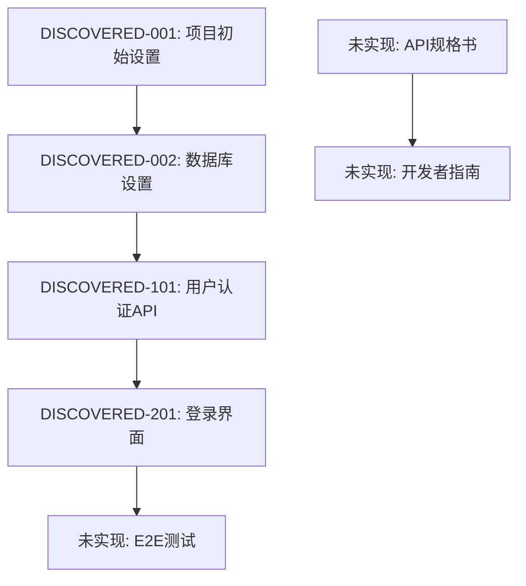

# rev-tasks

## 目的

分析现有代码库,识别已实现的功能并整理为任务列表。从已实现的功能逆推任务结构、依赖关系、实现详情并进行文档化。

## 前提条件

- 存在待分析的代码库
- 存在 `docs/reverse/` 目录(如果不存在则创建)
- 可分析TypeScript/JavaScript、Python和其他代码

## 执行内容

1. **代码库结构分析**
   - 理解目录结构
   - 确认配置文件(package.json、tsconfig.json、requirements.txt等)
   - 分析依赖关系

2. **功能组件识别**
   - 前端组件
   - 后端服务/控制器
   - 数据库相关(模型、迁移)
   - 工具函数
   - 中间件

3. **API端点提取**
   - REST API端点
   - GraphQL解析器
   - WebSocket处理器
   - 路由定义

4. **数据库结构分析**
   - 表定义
   - 关系
   - 迁移文件
   - 索引设置

5. **UI/UX实现分析**
   - 界面组件
   - 状态管理实现
   - 路由
   - 样式方法

6. **测试实现确认**
   - 单元测试的存在
   - 集成测试的存在
   - E2E测试的存在
   - 测试覆盖率

7. **任务逆推与整理**
   - 将已实现的功能分解为任务
   - 自动分配任务ID
   - 推测依赖关系
   - 预估实现工时

8. **文件创建**
   - 保存为 `docs/reverse/{项目名}-discovered-tasks.md`
   - 结构化文档化发现的任务

## 输出格式示例

````markdown
# {项目名} 发现任务列表

## 概要

**分析日期**: {分析执行日期}
**目标代码库**: {路径}
**发现任务数**: {数量}
**预估总工时**: {小时}

## 代码库结构

### 项目信息
- **框架**: {使用的框架}
- **语言**: {使用的语言}
- **数据库**: {使用的数据库}
- **主要库**: {主要依赖关系}

### 目录结构
```
{目录树}
```

## 发现的任务

### 基础·配置任务

#### DISCOVERED-001: 项目初始设置

- [x] **任务完成** (已实现)
- **任务类型**: DIRECT
- **实现文件**:
  - `package.json`
  - `tsconfig.json`
  - `.env.example`
- **实现详情**:
  - {发现的配置内容}
- **预估工时**: {小时}

#### DISCOVERED-002: 数据库设置

- [x] **任务完成** (已实现)
- **任务类型**: DIRECT
- **实现文件**:
  - `src/database/connection.ts`
  - `migrations/001_initial.sql`
- **实现详情**:
  - {发现的数据库设置内容}
- **预估工时**: {小时}

### API实现任务

#### DISCOVERED-101: 用户认证API

- [x] **任务完成** (已实现)
- **任务类型**: TDD
- **实现文件**:
  - `src/auth/auth.controller.ts`
  - `src/auth/auth.service.ts`
  - `src/auth/jwt.strategy.ts`
- **实现详情**:
  - 登录/登出功能
  - JWT令牌发行
  - 认证中间件
- **API端点**:
  - `POST /auth/login`
  - `POST /auth/logout`
  - `POST /auth/refresh`
- **测试实现状况**:
  - [x] 单元测试: `auth.service.spec.ts`
  - [x] 集成测试: `auth.controller.spec.ts`
  - [ ] E2E测试: 未实现
- **预估工时**: {小时}

### UI实现任务

#### DISCOVERED-201: 登录界面

- [x] **任务完成** (已实现)
- **任务类型**: TDD
- **实现文件**:
  - `src/components/Login/LoginForm.tsx`
  - `src/components/Login/LoginForm.module.css`
  - `src/hooks/useAuth.ts`
- **实现详情**:
  - 登录表单
  - 验证功能
  - 错误处理
- **UI/UX实现状况**:
  - [x] 响应式设计
  - [x] 加载状态
  - [x] 错误显示
  - [ ] 可访问性: 部分实现
- **测试实现状况**:
  - [x] 组件测试: `LoginForm.test.tsx`
  - [ ] E2E测试: 未实现
- **预估工时**: {小时}

## 未实现·改进推荐事项

### 缺失的测试

- [ ] **E2E测试套件**: 主要用户流程测试
- [ ] **性能测试**: API响应时间测试
- [ ] **安全测试**: 认证·授权测试

### 代码质量改进

- [ ] **TypeScript类型安全**: 部分使用了any类型
- [ ] **错误处理**: 统一的错误处理
- [ ] **日志输出**: 结构化日志实现

### 文档不足

- [ ] **API规格书**: 未实现OpenAPI/Swagger
- [ ] **开发者指南**: 设置程序书
- [ ] **部署程序书**: 生产环境构建程序

## 依赖关系图



## 实现模式分析

### 架构模式
- **实现模式**: {发现的模式}
- **状态管理**: {使用的状态管理}
- **认证方式**: {实现的认证方式}

### 编码风格
- **命名规则**: {发现的命名规则}
- **文件构成**: {文件构成模式}
- **错误处理**: {错误处理模式}

## 技术债务·改进点

### 性能
- {发现的性能问题}

### 安全性
- {发现的安全问题}

### 可维护性
- {发现的可维护性问题}

## 推荐下一步

1. **实现缺失测试** - 特别是E2E测试套件
2. **完善文档** - API规格书和设置指南
3. **代码质量改进** - TypeScript类型安全和错误处理
4. **安全强化** - 认证·授权详细审查

````

## 分析目标文件的自动检测

### 前端
- React: `*.tsx`, `*.jsx`, `*.ts`, `*.js`
- Vue: `*.vue`, `*.ts`, `*.js`
- Angular: `*.component.ts`, `*.service.ts`, `*.module.ts`

### 后端
- Node.js: `*.ts`, `*.js` (Express、NestJS等)
- Python: `*.py` (Django、FastAPI等)
- Java: `*.java` (Spring Boot等)

### 数据库
- SQL: `*.sql`, `migrations/*`
- ORM: 模型文件、配置文件

### 配置文件
- `package.json`, `tsconfig.json`, `webpack.config.js`
- `requirements.txt`, `Pipfile`, `pyproject.toml`
- `pom.xml`, `build.gradle`

## 执行命令示例

```bash
# 分析当前目录
claude code rev-tasks

# 分析特定目录
claude code rev-tasks --path ./backend

# 限定为特定技术栈分析
claude code rev-tasks --tech react,nodejs

# 详细分析(包含测试覆盖率等)
claude code rev-tasks --detailed

# 指定输出格式
claude code rev-tasks --format json
```

## 执行后确认

- 显示发现的任务数和预估工时
- 显示已实现/未实现的功能列表
- 汇总显示技术债务·改进推荐事项
- 建议下一个逆向工程步骤(设计书生成等)
